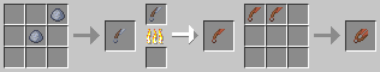

# Ceramic Shears

[.svg)](https://www.curseforge.com/minecraft/mc-mods/ceramic-shears)
[.svg)](https://www.curseforge.com/minecraft/mc-mods/ceramic-shears/files)

This is a **Minecraft Forge** mod which adds **Ceramic Shears** to the game.

           
For more information check out the **Wiki**: https://github.com/cech12/CeramicShears/wiki